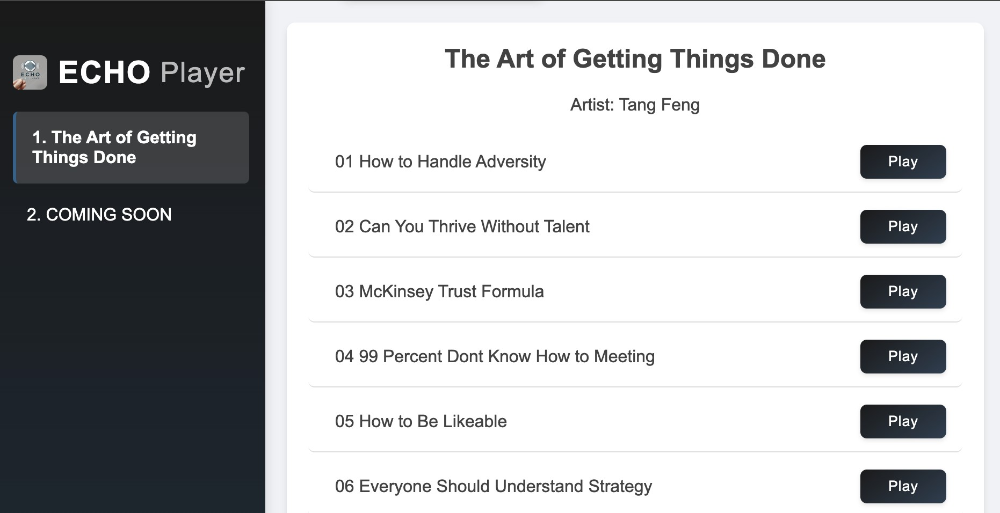

<div align="center">
  <h1>Luminous Isle - Elegant Web Audio Player</h1>
</div>

A minimalist and elegant web-based audio player designed for podcast and audiobook listening. Built with pure HTML, CSS, and JavaScript, offering a clean and intuitive user interface.


<div align="center">
  
</div>

## Features

- 🎨 Clean and modern interface
- 📱 Fully responsive design (mobile & desktop)
- 📚 Organized album/playlist management
- 🌓 Elegant gradient UI design

## Technical Highlights

- Zero dependencies, built with vanilla JavaScript
- CSS Grid and Flexbox for responsive layouts
- Modern CSS features including:
  - CSS Grid
  - Flexbox
  - CSS Variables
  - Media Queries
  - CSS Transitions
  - Backdrop Filter

## Usage

1. Place your audio files in the `data/albums` directory
2. Configure your playlists in `data/albums.json`
3. Deploy to any static web server

## Structure

```
luminous-isle/
├── index.html
├── data/
│   ├── albums.json
│   └── albums/
└── assets/
    └── images/
```

## License

MIT License
